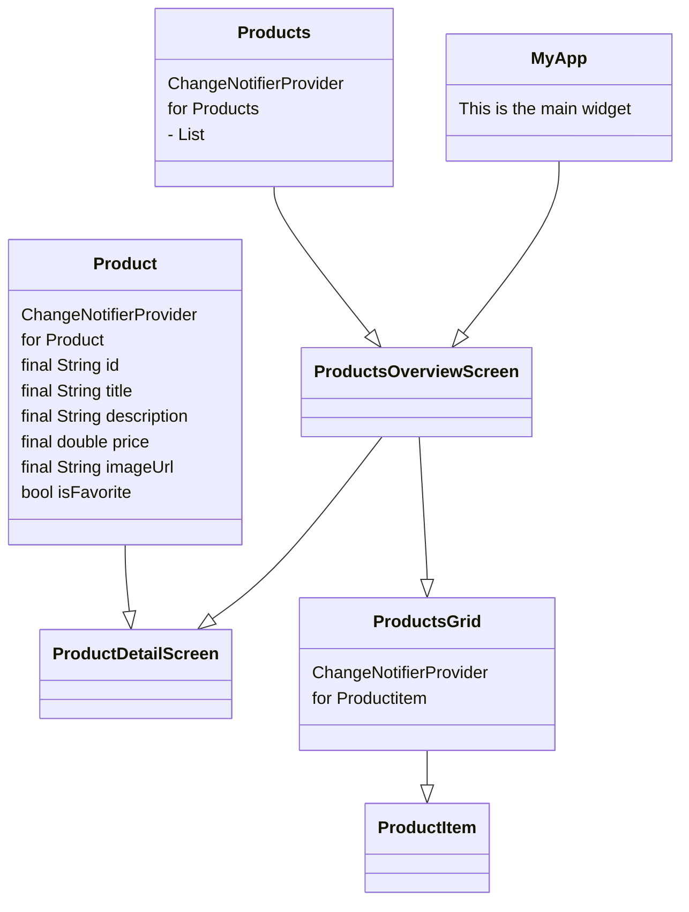

# Shop App Design

The Shop App aims to be a sample app that demonstrates inheritance to provide data to the right widges for UI-rendering.


## Overview

I first will explain the layout of the app using a representation of the key widgets in the widget tree. The chart is created with the mermaid markdown syntax. You might need a mermaid extension for your browser or code-editor to read it properlu.Secondly the Provider package will be explained using code examples from the source code.


## The widget tree

The shop app structure looks like following ad uses Product and Products as ChangeNotifierProvider. The class is part of the [Provider package](https://pub.dev/packages/provider) in the Flutter Package Pub.



## Provider package

The provider package 


### Code examples

How the provider package works is to mixin a class with a ChangeNotifier Mixin using the "with" keyword. For example like this.

```dart
class Products with ChangeNotifier {
    ...
}
```

The Products class is now mixed in with ChangeNotifier methods so it can provide data to widgets that live further down the tree. You can use a ChangeNotifier not only for classes, but also on variables . A good example for this is the following:

```dart
class ProductsGrid extends StatelessWidget {
  @override
  Widget build(BuildContext context) {
    final productsData = Provider.of<Products>(context);
    final loadedProducts = productsData.productitems;
    return GridView.builder(
      padding: const EdgeInsets.all(10.0),
      itemCount: loadedProducts.length,
      itemBuilder: (ctx, i) => ChangeNotifierProvider(
        create: (c) => loadedProducts[i],
        child: ProductItem(),
      ),
      gridDelegate: SliverGridDelegateWithFixedCrossAxisCount(
        crossAxisCount: 2,
        childAspectRatio: 3 / 2,
        crossAxisSpacing: 10,
        mainAxisSpacing: 10,
      ),
    );
  }
}
```

Within this ProductsGrid class the GridView widgets itembuilder is fed with a provider of the selected item of a list variable that comes from the Provider.of<Products> further up in the tree. 